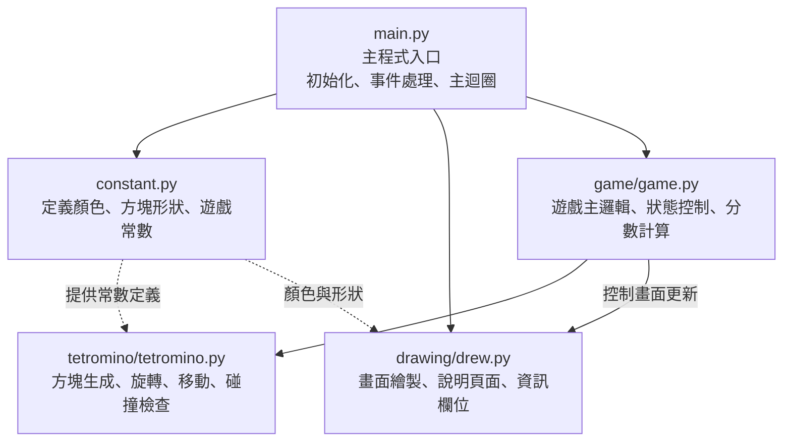

# Tetris Game 俄羅斯方塊小遊戲


用Pygame製作的俄羅斯方塊遊戲，Python版本為3.11.7  


> 目錄  
> [1. 檔案結構](#1-檔案結構)  
> [2. 遊戲流程](#2-遊戲流程)  
> [3. 規則與功能說明](#3-規則與功能說明)  
> [4. 操作說明](#4-操作說明)  
> [5. 未來延伸方向](#5-未來延伸方向)  
> [6. 參考資料](#6-參考資料)  
> [7. 版本說明](#7-版本說明)  
> [8. 執行圖片](#8-執行圖片)  

---

## 1. 檔案結構

```
Tetris_game_4.2/
├── main.py           # 主程式，負責初始化、事件處理與遊戲流程控制
├── constant.py       # 顏色與方塊定義、遊戲常數
├── drawing/
│   ├── __init__.py   
│   └── drew.py       # 畫面物件、說明介面、遊戲畫面繪製
├── game/
│   ├── __init__.py
│   └── game.py       # 遊戲狀態、分數計算、等級邏輯、Hold功能
├── tetromino/
│   ├── __init__.py
│   └── tetromino.py  # 方塊行為處理
```
> [點此下載完整專案檔案](https://drive.google.com/drive/folders/1J-Jz3yHZWjVSbtoAY-YQXAhpER8JNgPL?usp=sharing)  

### 模組互動流程圖（by Mermaid）



---

## 2. 遊戲流程

1. 執行main.py開始遊戲（記得切換輸入法）
2. 顯示說明畫面（英文字體比較好看所以用英文）
3. 進入遊戲，透過方向鍵操控方塊
5. 當方塊堆疊至頂部，顯示結束畫面
6. 按R重新開始或按esc退出遊戲

---

## 3. 規則與功能說明

  

|   功能   |                 說明                      |顯示欄位 |      說明     |
|:-------:|-------------------------------------------|:------:|---------------|
|**方塊種類**  |共七種（I, O, T, S, Z, J, L）              |**Next**    |下一個掉落的方塊|
|**分數計算**  |根據單次消除的列數（1~4列）得到不同分數      |**Max**     |單次消除最大列數|
|**Level功能** |每10000分提升等級並加快速度                 |**Cumulate**|累積消除的總列數|
|**Next功能**  |顯示下一個方塊                             |**Score**   |目前得到的分數  |
|**Hold功能**  |將正在落下的方塊儲存起來（每個新方塊僅限一次）|**Hold**    |目前保存的方塊  |
|**除錯模式**  |用陣列數字顯示方塊                          |**Level**   |目前的等級      |

---

## 4. 操作說明


| 按鍵 | 功能 | 按鍵 | 功能 |
|:------:|------|:------:|------|
| ⭠ / ⭢ | 移動方塊（左 / 右） | Space | Hold 當前方塊 |
| ⭡ | 加速下落 | D | 顯示 / 關閉除錯訊息 |
| ⭣ | 旋轉方塊 | ESC | 離開遊戲 |

---

## 5. 未來延伸方向

| 延伸功能 | 說明 |
|:----------:|------|
| Combo功能 | 根據連續消除的行數給予bonus分數 |
| 排行榜功能 | 增加本地或線上分數記錄系統 |
| 音效與背景音樂 | 增加遊戲音效、音樂、音量控制 |
| Web版本 | 使用 PyScript 或改用 JavaScript 製作網頁版遊戲 |
| 多人對戰 | 透過網路對戰或本地雙人模式 |
| 方塊skin / 主題 | 支援自訂方塊樣式與畫面主題 |
| 加入AI | 把AI加入到遊戲中，比較不同AI的表現 |

---

## 6. 參考資料

[Pygame 遊戲實作](https://hackmd.io/@Derek46518/HyZHsD0Qo#Pygame-%E9%81%8A%E6%88%B2%E5%AF%A6%E4%BD%9C)

[【Python】那些年我們一起玩過的遊戲(二)-俄羅斯方塊](https://uupgrade.medium.com/python-%E9%82%A3%E4%BA%9B%E5%B9%B4%E6%88%91%E5%80%91%E4%B8%80%E8%B5%B7%E7%8E%A9%E9%81%8E%E7%9A%84%E9%81%8A%E6%88%B2-%E4%BA%8C-%E4%BF%84%E7%BE%85%E6%96%AF%E6%96%B9%E5%A1%8A-2250e08b72a6)

---

## 7. 版本說明

| 版本 | 說明 |
|:----------:|------|
| 1.0 | 初次上傳，最基本俄羅斯方塊功能 |
| 1.1 | 旋轉卡牆&重疊bug修正、debug message顯示修正 |
| 2.0 | 新增Hold功能、Max分數計算修正 |
| 3.0 | 新增分數系統、給予多行消除bonus、改用分數判定level |
| 4.0 | 新增遊戲開始前的說明 |
| 4.1 | 新增遊戲結束結算畫面、修改速度計算方式 |
| 4.2 | 修改顏色 |
| 4.3 | 速度修正 |

---

## 8. 執行圖片

### ▸ 規則說明畫面
> 顯示遊戲規則、功能、顯示畫面說明，瀏覽後按任意按鍵前往下一頁
  

### ▸ 操作介面畫面  
> 顯示操作方式和說明  


### ▸ 遊戲畫面  
> 遊戲進行中


### ▸ 遊戲畫面（開啟除錯訊息）  
> 遊戲進行中（開啟除錯訊息）  
  

### ▸ 結算畫面  
> 結算畫面  
  


  


